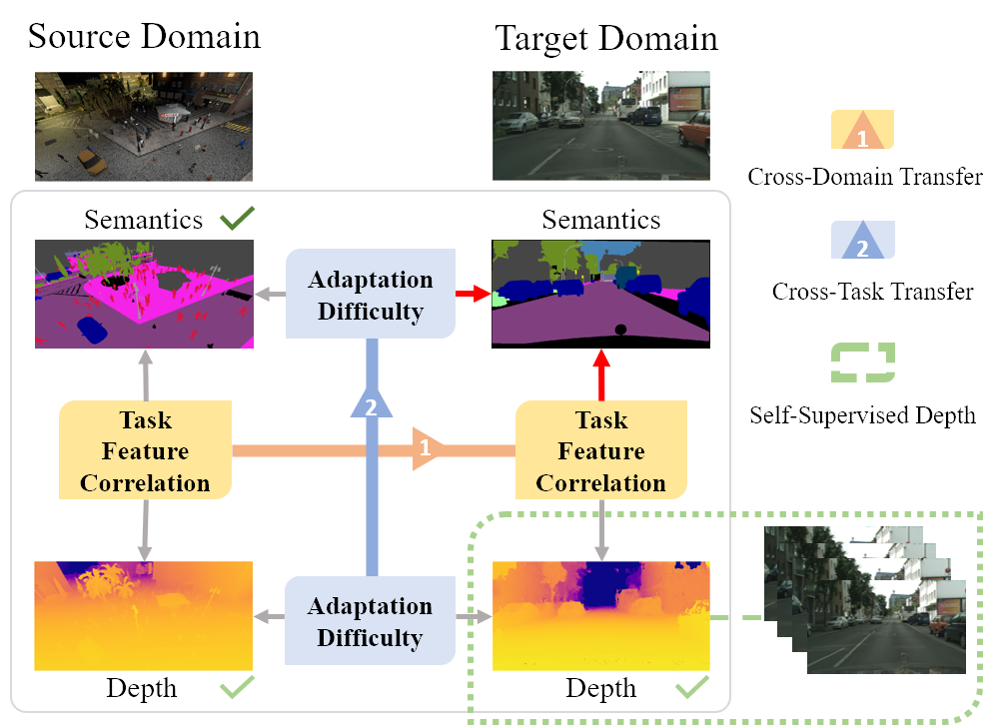

# CorDA
Code for our paper [Domain Adaptive Semantic Segmentation with Self-Supervised Depth Estimation ICCV21](http://arxiv.org/abs/2104.13613) 


## Prerequisite
Please create and activate the following conda envrionment. 
```bash
# It may take several minutes for conda to solve the environment
conda update conda
conda env create -f environment.yml
conda activate corda 
```
Code was tested on a V100 with 16G Memory. To reproduce our results, please kindly create and use this environment.

## Train a CorDA model
```bash
# Train for the SYNTHIA2Cityscapes task
bash run_synthia_stereo.sh
# Train for the GTA2Cityscapes task
bash run_gta.sh
```

## Test the trained model
```bash
bash shells/eval_syn2city.sh
bash shells/eval_gta2city.sh
```
Pre-trained models are provided ([Google Drive](https://drive.google.com/file/d/1yYV5O7In2sgYKA9cY8-12p9VdyWtRuFH/view?usp=sharing)). Please put them in `./checkpoint`. 

+ The provided SYNTHIA2Cityscapes model achieves 56.3 mIoU (16 classes) at the end of the training. 
+ The provided GTA2Cityscapes model achieves 57.7 mIoU (19 classes) at the end of the training.

Reported Results on SYNTHIA2Cityscapes
| Method | mIoU*(13)| mIoU(16) |
| -------- | -------- | -------- |
|  CBST   | 48.9   | 42.6     |
|  FDA    | 52.5   | -        |
|  DADA   | 49.8   | 42.6     |
|  DACS   | 54.8   | 48.3     |
|**CorDA**| **62.8**   | **55.0**     |

## Citation
Please cite our work if you find it useful.
```bibtex
@inproceedings{wang2021domain,
  title={Domain Adaptive Semantic Segmentation with Self-Supervised Depth Estimation},
  author={Wang, Qin and Dai, Dengxin and Hoyer, Lukas and Fink, Olga and Van Gool, Luc},
  booktitle={Proceedings of the IEEE/CVF International Conference on Computer Vision},
  year={2021}
}
```

## Acknowledgement 
+ DACS is used as our codebase and  our DA baseline [official](https://github.com/vikolss/DACS) 
+ SFSU as the source of stereo Cityscapes depth estimation [Official](https://people.ee.ethz.ch/~csakarid/SFSU_synthetic/) 

## Data links
+ Download [links](https://qin.ee/depth/) 
    + Stereo Depth Estimation for Cityscapes
    + Mono Depth Estimation for GTA
    + SYNTHIA Depth and images [SYNTHIA-RAND-CITYSCAPES (CVPR16)
](http://synthia-dataset.net/downloads/)
+ Dataset Folder Structure [Tree](./extra/data_tree)


For questions regarding the code, please contact wang@qin.ee .
